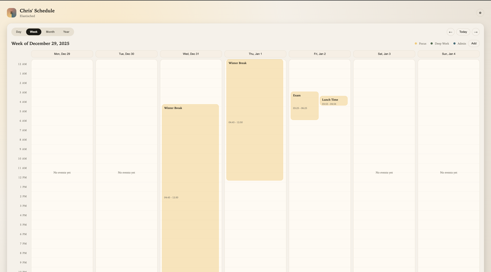

# Elastisched

Elastisched is a scheduling playground built around "blobs": flexible, schedulable blocks of time with constraints. The project includes a FastAPI backend and a lightweight UI for exploring day/week/month/year views.

## Core Concepts

- Blobs represent tasks/events with a schedulable time range and optional policies.
- Policies can make blobs overlappable, invisible, or splittable to guide scheduling behavior.
- Scheduling uses simulated annealing to search for good local minima under constraints.

## Features

- Day, week, month, and year views
- Interactive range selection in the UI
- Configurable schedule metadata (name, subtitle, minute granularity)
- JSON-based blob storage with SQLite

## Project Layout

- `src/elastisched/api`: FastAPI backend and models
- `frontend`: UI (HTML/CSS/JS)
- `tests`: API and recurrence tests

## Quick Start

1. Install dependencies.
2. Run the API.
3. Open the UI at `/ui` or open `frontend/index.html` directly.

## Troubleshooting

- If you see a GLIB/GCC mismatch in native builds, align your Conda GCC/G++ with the version used to compile the library.
